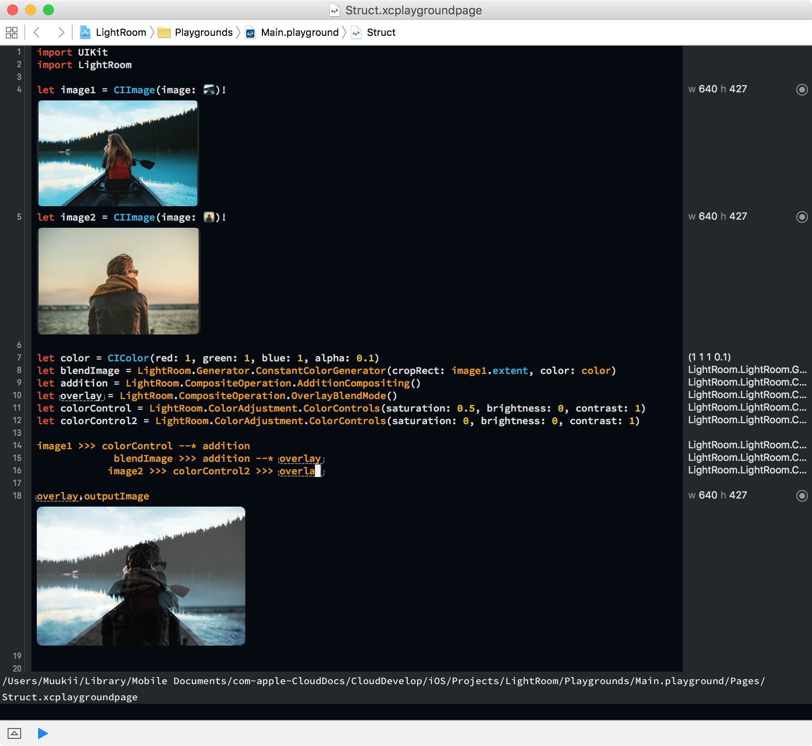
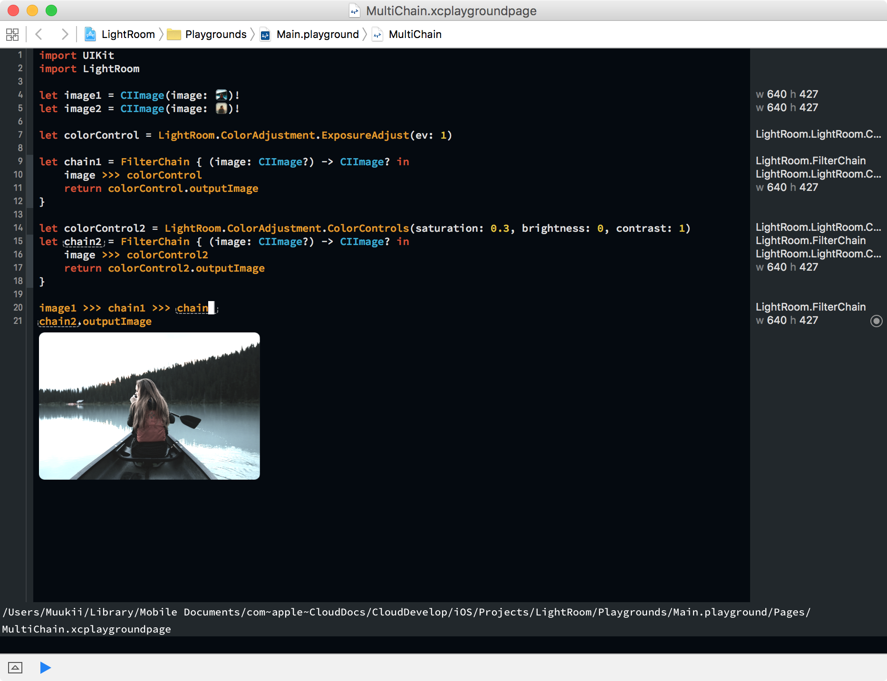

# LightRoom
Easy Chaining ImageFilter with CoreImage

---

## Installation

LightRoom is available through CocoaPods. To install it, simply add the following line to your Podfile:

```
pod "AppVersionMonitor"
```

## Usage

First, create `FilterComponent`s.
Then create a `FilterChain` using them.

### Chaining

```
image1 >>> colorControl --* addition
             blendImage >>> addition --* overlay
            image2 >>> colorControl2 >>> overlay
```




### Multiple Chaining

You can connect `FilterChain`s with each other using `>>>`

```
let colorControl = LightRoom.ColorAdjustment.ExposureAdjust(ev: 1)

let chain1 = FilterChain { (image: CIImage?) -> CIImage? in
    image >>> colorControl
    return colorControl.outputImage
}

let colorControl2 = LightRoom.ColorAdjustment.ColorControls(saturation: 0.3, brightness: 0, contrast: 1)
let chain2 = FilterChain { (image: CIImage?) -> CIImage? in
    image >>> colorControl2
    return colorControl2.outputImage
}

image1 >>> chain1 >>> chain2
chain2.outputImage
```




### Performance

FilterComponent has a CIFilter, which is cached and will be created only once.

This structure is advantageous in performance, and is great for real-time filtering camera implementation.
