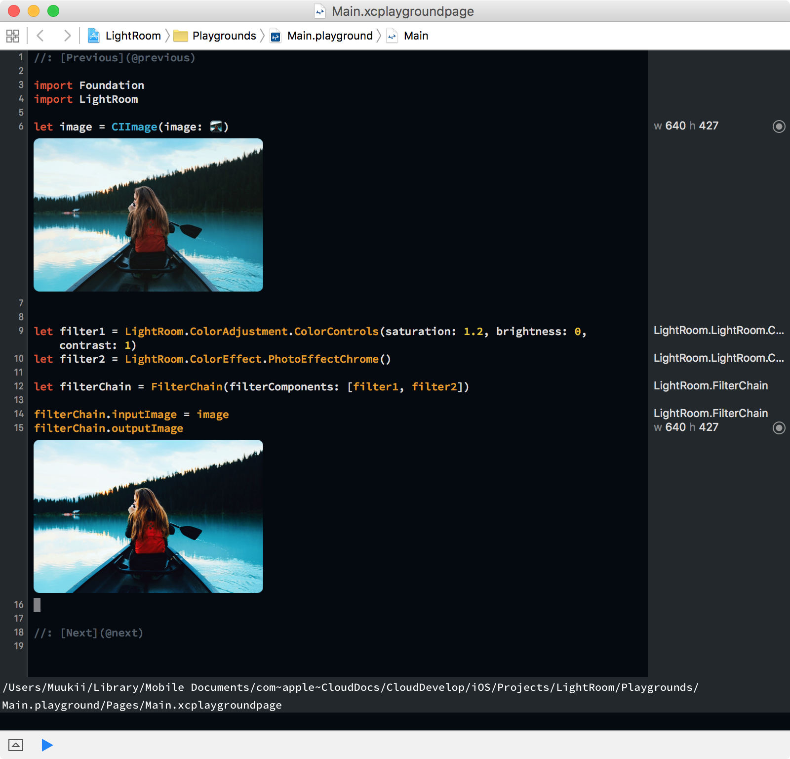
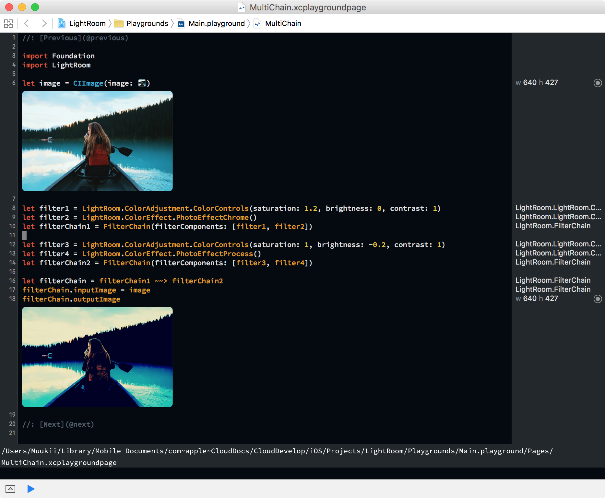

# LightRoom
Easy Chaining ImageFilter with CoreImage

---

## Installation

LightRoom is available through CocoaPods. To install it, simply add the following line to your Podfile:

```
pod "AppVersionMonitor"
```

## Usage

First, create `FilterComponent`s.
Then create a `FilterChain` using them.

### Chaining

```
let filter1 = LightRoom.ColorAdjustment.ColorControls(saturation: 1.2, brightness: 0, contrast: 1)
let filter2 = LightRoom.ColorEffect.PhotoEffectChrome()
let filterChain1 = FilterChain(filterComponents: [filter1, filter2])
```




### Multiple Chaining

You can connect `FilterChain`s with each other using `~~>`

```
let filter3 = LightRoom.ColorAdjustment.ColorControls(saturation: 1, brightness: -0.2, contrast: 1)
let filter4 = LightRoom.ColorEffect.PhotoEffectProcess()
let filterChain2 = FilterChain(filterComponents: [filter3, filter4])
```




### Performance

FilterComponent has a CIFilter, which is cached and will be created only once.

This structure is advantageous in performance, and is great for real-time filtering camera implementation.
